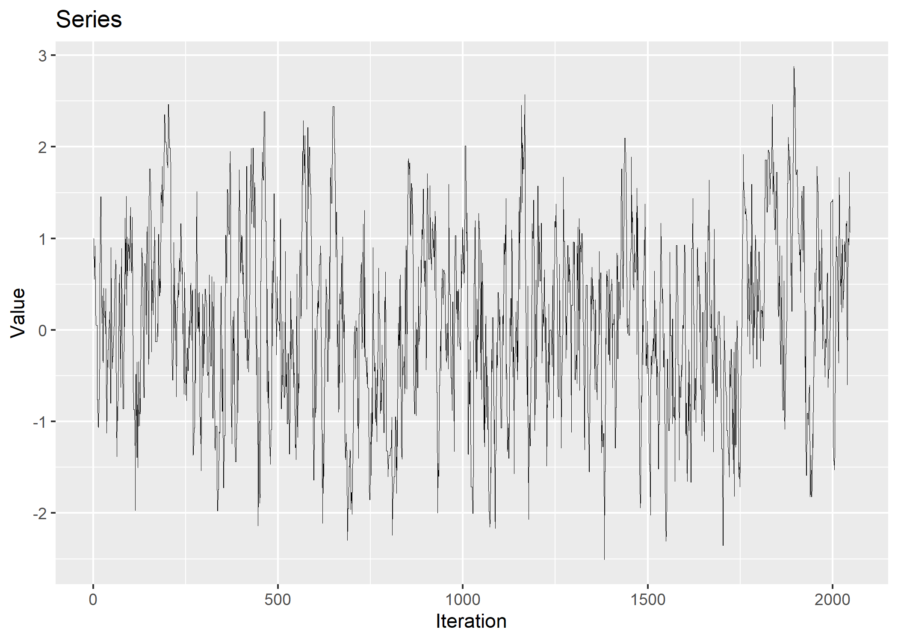

<!-- README.md is generated from README.Rmd. Please edit that file -->

# samplr

<!-- badges: start -->
<!-- badges: end -->

The goal of samplr is to provide tools to understand human performance
from the perspective of sampling, both looking at how people generate
samples and how people use the samples they have generated. A longer
overview and other resources can be found at
[sampling.warwick.ac.uk](sampling.warwick.ac.uk)

## Installation

You can install the released version of SampleR from
[Github](https://github.com/lucas-castillo/samplr) with:

    devtools::install_github("lucas-castillo/samplr")

## Example

samplr provides tools to generate samples following particular
algorithms

``` r
library(samplr)
set.seed(0118999)
chain <- sampler_mcmc(distr_name = "norm", distr_params = c(0,1), start = 1, sigma_prop = diag(1) * .5, iterations = 2048)
print(chain[[1]][1:20])
#>  [1]  1.00000000  1.00000000  0.55184878  0.78960729  0.81028884  0.13077598
#>  [7]  0.91602932  0.09927559 -0.04626322 -0.17780208 -0.12099197 -1.03343621
#> [13] -0.98615098 -0.63079177 -1.11736808  0.04886893  0.47235421  0.24165146
#> [19]  0.24165146  0.23985357
```

As well as tools to diagnose the patterns both from samplers and
participants:

``` r
plot_qqplot(chain[[1]], change = TRUE)
```


``` r
plot_series(chain[[1]])
```


